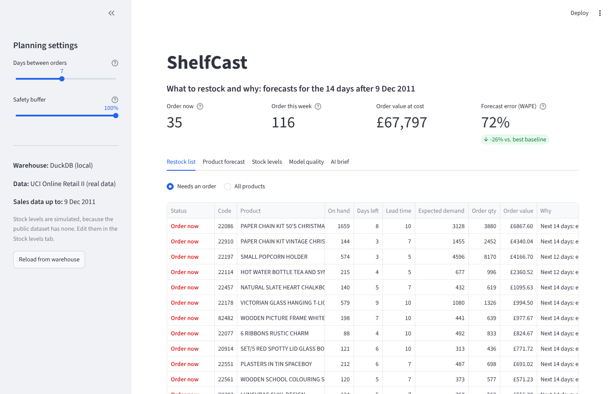
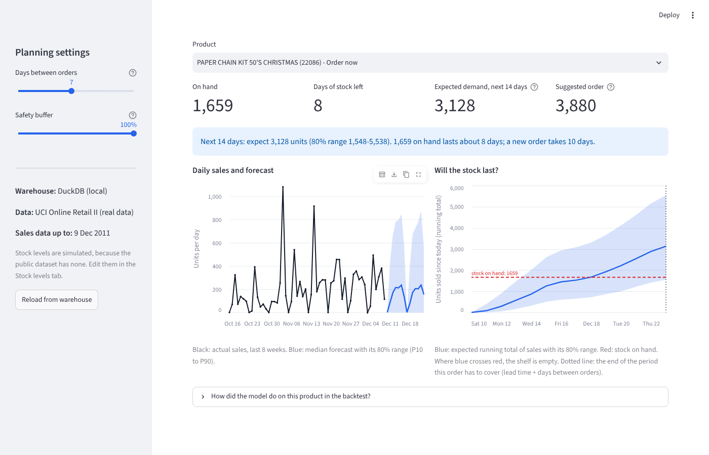
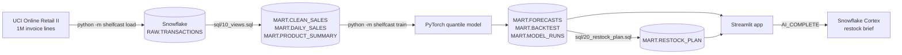

# ShelfCast

[](https://github.com/FarnooshMemari/shelfcast/actions/workflows/tests.yml)

ShelfCast helps a small online shop decide what to restock. Sales data and the business rules live in Snowflake, a PyTorch model forecasts demand for each product, and a Streamlit app turns the forecasts into an order list: what to order today, how much, and why.

Built for [ForgeHacks 2026](https://forgehacks-2026.devpost.com) (AI + Business track).



## The problem

Small online shops often reorder by gut feeling or by looking at last month's average. That goes wrong both ways: best sellers run out, and slow sellers pile up and tie up cash. A forecast alone doesn't solve it. The person placing orders needs to know what to order today, how much, and why.

## What it does

1. Loads two years of real transactions from a UK online gift shop (UCI Online Retail II, 1,067,371 invoice lines) into Snowflake.
2. Cleans them with SQL in Snowflake: cancellations, returns, postage, fees and bulk orders that were cancelled later are removed, then sales are rolled up per product per day.
3. Trains one PyTorch model on the 200 best sellers. For each of the next 14 days it gives a low, expected and high forecast (P10 / P50 / P90), and it does the same for the running total, since that is what an order has to cover.
4. Turns the forecasts into decisions. Each product gets a status (Order now, Order this week, OK), an order quantity, its cost and a one-line reason. The same rules also run as a SQL view in Snowflake (`MART.RESTOCK_PLAN`).
5. Shows it all in a Streamlit app: sliders for the safety buffer and how often orders are placed, editable stock levels, charts for each product, the backtest results, and a short restock note written by Snowflake Cortex (or a built-in summary where Cortex isn't available).



## Results on real data

These results come from a full run on Snowflake (a trial account, 5 Oct 2026), started from a Kaggle notebook: 1,067,371 invoice lines loaded into `RAW.TRANSACTIONS`, cleaned with SQL inside Snowflake (1,036,831 clean sales lines, 4,706 products), and the forecasts and restock plan written back to the `MART` tables.

The model was trained without the last 14 days of data (26 Nov to 9 Dec 2011) and then forecast those days for the 200 products. Lower is better.

| Forecast | Daily error (WAPE) | Two-week total error (WAPE) |
|---|---|---|
| **ShelfCast (PyTorch)** | **71.6%** | **41.7%** |
| Same weekday last week | 101.1% | 52.6% |
| 28-day average | 97.1% | 42.0% |

- Daily error is 26% lower than the best simple baseline. For two-week totals the model and the 28-day average are about even (41.7% vs 42.0%).
- The ranges are well calibrated: 80.5% of the real two-week totals fell inside the model's 80% range. Adding up daily ranges instead (a common shortcut) gives a range 81% wider that caught 95% of totals. With the same stock levels, sizing orders that way would have bought 87% more stock (£132k instead of £70k at cost).
- Training takes about a minute on a CPU. Full report: [reports/RESULTS.md](reports/RESULTS.md).

WAPE is total absolute error divided by total units sold. Daily errors are high for every method because single products sell in lumpy wholesale orders (0 units one day, 400 the next), so the comparison with the baselines matters more than the raw number.

## How it works



### Model ([`shelfcast/model.py`](shelfcast/model.py))

- A small MLP (two hidden layers, about 128k parameters) trained on all 200 products at once, so slow sellers can borrow patterns from busy ones.
- Input: the last 56 days of sales divided by their average (so big and small sellers look alike), plus the weekdays of the 14 days being forecast.
- Output: P10 / P50 / P90 for each day and for the running total. The output layer keeps the quantiles in order and non-negative, and the running totals never decrease.
- Loss: quantile (pinball) loss. Early stopping uses the two weeks before the test period, and the final model is retrained on all the data.

### Restock rules ([`shelfcast/restock.py`](shelfcast/restock.py), same logic in [`sql/20_restock_plan.sql`](sql/20_restock_plan.sql))

- An order has to last until the next one arrives: lead time + days between orders.
- Target stock = expected demand for that period + buffer x (high forecast - expected). A 100% buffer plans for the P90, which is roughly a 90% chance of not running out.
- Order quantity = target - stock on hand - stock already on order.
- *Order now* if expected sales empty the shelf before a new order could arrive; *Order this week* if an order is needed but there is still time.

## Quick start (no accounts needed)

```bash
git clone https://github.com/FarnooshMemari/shelfcast.git
cd shelfcast
python -m venv .venv && source .venv/bin/activate      # Windows: .venv\Scripts\activate
pip install -r requirements.txt
streamlit run app/streamlit_app.py
```

The app starts with a saved snapshot of the Snowflake run (the `demo/` folder). To run the whole pipeline on a local DuckDB file:

```bash
python -m shelfcast all              # real data: 45 MB download, reading the Excel file takes a few minutes
python -m shelfcast all --synthetic  # or synthetic data, about 20 seconds
```

If the download fails, get `online_retail_II.xlsx` from the [UCI page](https://archive.ics.uci.edu/dataset/502/online+retail+ii) and run `python -m shelfcast all --excel path/to/online_retail_II.xlsx`.

On Linux, `pip install torch --index-url https://download.pytorch.org/whl/cpu` before installing the requirements gives a much smaller PyTorch download.

## Running on Snowflake

The SQL runs unchanged on Snowflake and DuckDB, so switching only needs credentials.

1. Create a free trial account at [signup.snowflake.com](https://signup.snowflake.com).
2. In Snowsight, open a SQL worksheet, paste [`sql/00_snowflake_setup.sql`](sql/00_snowflake_setup.sql), replace `YOUR_USER_NAME` and run all. It creates an X-Small warehouse that suspends after 60 idle seconds, a database, a project role and a programmatic access token (PAT).
3. Copy `.env.example` to `.env` and fill in `SNOWFLAKE_ACCOUNT`, `SNOWFLAKE_USER` and `SNOWFLAKE_PAT`. `SNOWFLAKE_USER` is your login name: if you sign in to Snowflake with a Microsoft or Google account, that is usually your email address.
4. Check the connection, run the pipeline and start the app:

```bash
python -m shelfcast check     # Connected to Snowflake as ...
python -m shelfcast all       # load 1M rows, run the SQL, train, write the forecasts back
streamlit run app/streamlit_app.py
```

The sidebar then shows Snowflake as the warehouse, and the AI brief tab can ask Snowflake Cortex to write the restock note. Cortex's `AI_COMPLETE` isn't available on Snowflake trial accounts; there the app shows its built-in summary instead. The plan can also be queried directly in Snowsight:

```sql
SELECT * FROM SHELFCAST.MART.RESTOCK_PLAN ORDER BY order_value DESC;
```

## Deploying the app

On [Streamlit Community Cloud](https://share.streamlit.io), create an app from this repo with `app/streamlit_app.py` as the main file. It installs the lighter `app/requirements.txt` (viewing results doesn't need PyTorch). To read live from Snowflake, add these under Advanced settings > Secrets:

```toml
SNOWFLAKE_ACCOUNT = "ORGNAME-ACCOUNTNAME"
SNOWFLAKE_USER = "YOUR_USER_NAME"
SNOWFLAKE_PAT = "paste-the-token-here"
SNOWFLAKE_ROLE = "SHELFCAST_ROLE"
```

Without secrets, or if Snowflake can't be reached, the app shows the saved snapshot from `demo/`.

## Commands

| Command | What it does |
|---|---|
| `python -m shelfcast data` | Download the real data (`--synthetic` makes synthetic data instead) |
| `python -m shelfcast load` | Load the transactions and run `sql/10_views.sql` |
| `python -m shelfcast train` | Backtest, train, forecast, write the restock plan and `reports/RESULTS.md` |
| `python -m shelfcast all` | The three steps above |
| `python -m shelfcast brief` | Print the restock brief (`--cortex` has Snowflake Cortex write it) |
| `python -m shelfcast snapshot` | Save the tables the app needs to `demo/` |
| `python -m shelfcast check` | Test the warehouse connection |

Add `--backend snowflake` or `--backend duckdb` before the command to pick one. The default is Snowflake when `SNOWFLAKE_ACCOUNT` is set and a local DuckDB file otherwise.

## Project layout

```
app/streamlit_app.py       web app
shelfcast/
    db.py                  one small interface for Snowflake and DuckDB
    data.py                download, synthetic data, daily sales matrix
    model.py               PyTorch quantile model and loss
    forecast.py            backtest against baselines, final training
    restock.py             order rules, brief, Snowflake Cortex
    pipeline.py            load, train, reports, snapshot
sql/
    00_snowflake_setup.sql
    10_views.sql           cleaning and daily sales (Snowflake and DuckDB)
    20_restock_plan.sql    restock plan as a view
demo/                      snapshot of the real run, used by the app
reports/RESULTS.md         backtest results, written by `train`
docs/                      screenshots
tests/
```

## Tests

```bash
pytest
```

The tests check that training windows never include future days, that forecasts are ordered and non-negative, the restock rules on small hand-made cases, the SQL cleaning, that the SQL plan matches the Python plan, the app (with Streamlit's AppTest) and the full command line on synthetic data. They run in about 15 seconds.

## Limitations

- Stock levels are simulated. The public data has sales but no inventory, lead times or costs, so these are generated per product. They can be edited in the app or replaced with a real `MART.INVENTORY` table.
- "Today" is 9 Dec 2011, the last day in the data.
- The backtest is a single 14-day window in the busiest season of the year. A rolling backtest over many windows would be a stronger test.
- The safety buffer slider moves linearly between the P50 and P90 forecasts, so values in between are only approximate service levels.

## Next steps

- Rolling backtests, plus holiday and price features.
- Train inside Snowflake (Snowpark Container Services) and refresh the plan on a schedule with Snowflake Tasks.
- Connect a real inventory feed and round orders to supplier pack sizes.

## Data and license

Data: Chen, D. (2012). Online Retail II [Dataset]. UCI Machine Learning Repository. https://doi.org/10.24432/C5CG6D, licensed under [CC BY 4.0](https://creativecommons.org/licenses/by/4.0/). The raw data is downloaded when the pipeline runs and is not stored in this repo; `demo/` holds aggregated results derived from it.

Code: [MIT License](LICENSE), Farnoosh Memari, 2026.
